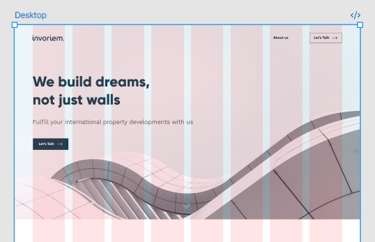
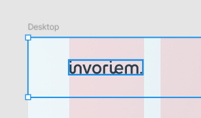
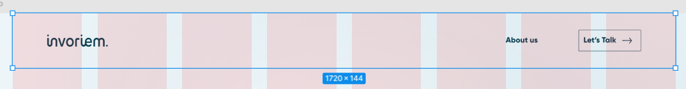

Поиск шрифтов: [webfonts.pro](https://webfonts.pro/)

Трактор: ctrl + shift + Q

1. Смотрим, есть ли сетка в макете, чтобы придерживаться её:

   * Выделяем Desktop, переходим в Layout guide, просматриваем сетку

   

   * Выбираем блок (header), прописываем отступы

   

   * Определяем ограничение контейнера по ширине (max-width 1720)

   

   * Добавляем отступы слева и справа (15px), прибавляем к ширине

   ```

   .container {
   	max-width: 1750px;  // было 1720
       padding: 0 15px;
   }
   ```
