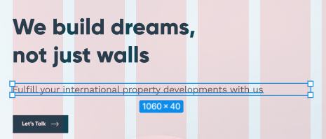

Поиск шрифтов: [webfonts.pro](https://webfonts.pro/)

Owlcarousel: [owlcarousel2.github.io/OwlCarousel2](https://owlcarousel2.github.io/OwlCarousel2/)

CDN JS (подключение карусели и jQuery): [cdnjs.com](https://cdnjs.com/)

Сток видео: [www.istockphoto.com/ru/%D0%B2%D0%B8%D0%B4%D0%B5%D0%BE](https://www.istockphoto.com/ru/%D0%B2%D0%B8%D0%B4%D0%B5%D0%BE/)

Трактор: ctrl + shift + Q

Пипетка: i

Размеры элемента: alt + ctrl

Дублировать слой: ctrl + D

Owlcarousel:

Подключаем карусель, плагин, тему

# Начало работы с макетом

1. Смотрим, есть ли сетка в макете, чтобы придерживаться её:

   * Выделяем Desktop, переходим в Layout guide, просматриваем сетку

   

   * Выбираем блок (header), прописываем отступы

   

   * Определяем ограничение контейнера по ширине (max-width 1720)

   

   * Добавляем отступы слева и справа (15px), прибавляем к ширине

   ```CSS

   .container {
   	max-width: 1750px;
     	margin: 0 auto; /* Центрируем контейнер */
   	padding: 0 15px;
   }
   ```

Далее даём блоку фон и прописываем минимальную высоту. Фон "дружелюбный", определяем пипеткой в Figma (клавиша i).

Или приём hio-header, когда шапка равна высоте экрана (чтобы не было скролла). Если контента будет больше - она будет больше по высоте, если меньше - меньше по высоте.

```CSS
.header {
	height: 100vh;
  	/* min-height: 1080px; */
  	background-color: #E0EDF1;
}
```

2. Раскидываем элементы шапки по краям (flex)

Задаём ограничение для текста по контентной части



```CSS
.header__content {
  max-width: 1060px;
}
```

Работаем над отступами между абзацами текста, если их будет много

```CSS
.header__text {
    margin-bottom: 72px;

    font-size: 34px;

    color: var(--dark-grey);
}

.header__text p + p {
    margin-top: 1em;
}
```

Позиционирование псевдоэлемента (стрелки) у кнопки

```CSS
.btn::after {
    content: '';
    position: absolute;
    width: 32px;
    height: 32px;

    right: 24;
    top: 50%;
    transform: translateY(-50%);
}
```

# Создание блока

1. Создаём разметку элементов
2. Ограничиваем блоки (title, text и тд) по ширине
3. Описываем отступы сверху-снизу

# Расположение кнопки по центру

```CSS

.video__btn {
    position: absolute;
    top: 50%;
    left: 50%;
    transform: translate(-50%, -50%)
}
```


# Проигрывание видео (скрипт)

```JavaScript
const videoBtn = document.querySelector('#video-btn');
const videoPicture = document.querySelector('.video__picture');
const videoWrapper = document.querySelector('.video');
const video = document.querySelector('#video-file');

videoBtn.addEventListener('click', function(){
    videoPicture.classList.add('none'); // Скрываем картинку
    videoWrapper.classList.remove('video-overlay'); // Убираем overlay

    if (video.paused) {
        video.play()
    }
})
```

- video.paused - свойство DOM-элемента (булево), показывающее текущее состояние (пауза или нет)
- video.play() - это нативный метод HTMLMediaElement, который просит браузер начать воспроизведение


# Полный пример настройки проигрывания видео

Скрипт

```JavaScript
const videoBtn = document.querySelector('#video-btn');
const videoPicture = document.querySelector('.video__picture');
const videoWrapper = document.querySelector('.video');
const video = document.querySelector('#video-file');

videoWrapper.addEventListener('click', function () {
    if (video.paused) {
        videoPicture.classList.add('none');
        videoWrapper.classList.remove('video-overlay');
        videoBtn.classList.add('none');

        video.play();
    } else {
        videoPicture.classList.remove('none');
        videoWrapper.classList.add('video-overlay');
        videoBtn.classList.remove('none');

        video.pause();
    }
});
```


HTML

```HTML
                    <div class="video video-overlay">
                        <button class="video__btn" id="video-btn">
                            
                        </button>

                        

                        <video class="video__object" id="video-file" loop>
                            <source src="/image/city.mp4" type="video/mp4">
                        </video>
                    </div>
```
