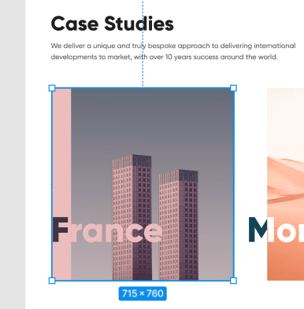

# Мой вариант разметки case-section

```HTML
    <main>
        <section class="case-section">
            <div class="case-section__content">
                <h2 class="case-section__header">Case Studies</h2>
                <div class="case-section__text">Lorem ipsum dolor sit amet consectetur, adipisicing elit. Voluptatibus expedita tenetur eveniet mollitia similique cum, nobis, esse porro nihil rerum repellat tempore saepe repudiandae modi ex quibusdam tempora, laudantium alias?</div>
            </div>

            <div class="case-section__slider">
                <ul class="case-section__list">
                    <li class="case-section__item">
                        <a href="#!" class="case-section__link">
                            <span class="case-section__title">France</span>
                            
                        </a>
                    </li>
                  
                </ul>
            </div>
        </section>
    </main>
```


# Расчёт размера слайдера


